# Espaço de cores

Um *espaço* ou *modelo* de cores é o método utilizado para descrever como as cores podem ser representadas, consistente com um sistema de coordenadas tridimensional e um sub-espaço onde cada cor é representada por um ponto ou *pixel*. Diferentes *modelos* atendem a diferentes especificações de *hardware*. A seguir, apresentamos as representações mais comuns no processamento de imagens, começando pelas mais intuitivas (**RGB** e **grayscale**) e avançando para modelos com propriedades específicas (**HSV**, **Lab**, **HLS** e **YCrCb**).

Uma imagem **RGB** (*truecolor*) é representada por uma matriz tridimensional M x N x 3. Cada pixel da imagem possui uma cor, resultante da combinação da intensidade de cada um dos canais: **red**, **green** e **blue**. É o modelo nativo da maioria das câmeras e telas.

Uma imagem em tons de cinza (**grayscale**) é representada por uma matriz bidimensional M x N, em que cada elemento expressa a intensidade do pixel.  Pode ser entendida como um caso particular do **RGB** em que os três canais são iguais, ou como um espaço próprio de luminância.

O espaço **HSV** (*Hue, Saturation, Value*) reorganiza as informações de cor em três componentes mais intuitivos para a percepção humana: **matiz** (*hue*), que representa o tipo de cor; **saturação** (*saturation*), que indica a pureza da cor; e **valor** (*value*), que representa o brilho. É amplamente utilizado em tarefas de segmentação por cor e rastreamento de objetos, pois separa a informação de cor (matiz) da informação de luminosidade.

> **Atenção:** embora teoricamente o matiz seja um ângulo de 0° a 360°, o OpenCV armazena esse canal em 8 bits, mapeando-o para o intervalo **[0, 179]** — ou seja, cada unidade equivale a cerca de 2 graus do círculo cromático. Já os canais **S** e **V** são representados no intervalo [0, 255]. Essa convenção difere de outras bibliotecas (como PIL, scikit-image e MATLAB), que utilizam H em [0, 360]. Portanto, ao definir limiares para segmentação no OpenCV, é preciso considerar essa escala reduzida à metade.

O espaço **Lab** (ou **CIELAB**) foi projetado para ser perceptualmente uniforme, ou seja, a distância euclidiana entre duas cores nesse espaço corresponde aproximadamente à diferença percebida pelo olho humano. Seus três canais são: **L*** (luminosidade); **a*** (variação do verde ao vermelho); e **b*** (variação do azul ao amarelo). É muito utilizado em aplicações de comparação de cores e correção de iluminação.

O espaço **HLS** (*Hue, Lightness, Saturation*) é semelhante ao HSV, mas organiza as componentes de forma diferente: **matiz** (*hue*), **luminosidade** (*lightness*), que vai do preto ao branco, e **saturação** (*saturation*). Enquanto no HSV o canal *value* representa o brilho máximo da cor, no HLS a luminosidade representa a intensidade luminosa percebida, o que pode ser mais adequado em certas aplicações de processamento de imagens.

O espaço **YCrCb** separa a **luminância** (**Y**) das informações de **crominância** (**Cr** e **Cb**). O canal **Y** representa o brilho da imagem, enquanto **Cr** (crominância vermelha) e **Cb** (crominância azul) carregam as informações de cor. Essa separação é vantajosa em compressão de imagens e vídeos (como nos padrões JPEG e MPEG), pois permite descartar informações de crominância sem grande perda perceptual, além de ser útil em detecção de pele e segmentação.

> **Escalonamento no OpenCV:** assim como no HSV, os demais espaços também sofrem reescalonamento dos canais para caberem em 8 bits (`uint8`), o que difere das faixas teóricas normalmente apresentadas na literatura:
>
> | Espaço | Canal | Faixa teórica | Faixa no OpenCV (uint8) |
> |--------|-------|---------------|--------------------------|
> | HSV    | H     | 0 – 360       | 0 – 179                  |
> | HSV    | S, V  | 0 – 1 (ou 0 – 100 %) | 0 – 255           |
> | Lab    | L*    | 0 – 100       | 0 – 255                  |
> | Lab    | a*, b*| -127 – 127    | 0 – 255 (com offset de +128) |
> | HLS    | H     | 0 – 360       | 0 – 179                  |
> | HLS    | L, S  | 0 – 1         | 0 – 255                  |
> | YCrCb  | Y     | 16 – 235      | 0 – 255 (aproximado)     |
> | YCrCb  | Cr, Cb| 16 – 240      | 0 – 255 (aproximado)     |
>
> Por isso, ao interpretar os valores dos pixels ou definir limiares de segmentação, é fundamental consultar a documentação do OpenCV e considerar essas faixas específicas, em vez de assumir os intervalos teóricos.

A seguir, visualizamos lado a lado a mesma imagem convertida para cada um desses espaços, evidenciando como cada modelo representa a informação de cor de maneira distinta.


### Carregamos as bibliotecas


```python
import cv2
import numpy as np
from matplotlib import pyplot as plt
```

### Lemos a imagem


```python
img = cv2.imread('beijo.jpg')
```

Por razões históricas, o pacote **opencv** utiliza por padrão o formato **BGR**. <br>
Visualizamos a seguir a figura rupestre intitulada "O beijo", localizada no Parque Serra da Capivara, no Piauí.

### Exibimos a imagem original


```python
plt.imshow(img)
plt.title("Imagem original (BGR)")
plt.axis("off")   # remove os eixos
plt.show()
```


    
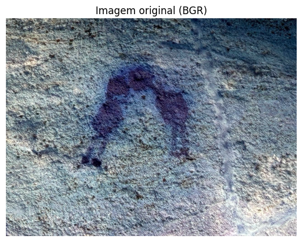
    


### Exibimos diferentes espaços de cores


```python
rgb = cv2.cvtColor(img, cv2.COLOR_BGR2RGB)
gray = cv2.cvtColor(img, cv2.COLOR_BGR2GRAY)
hsv = cv2.cvtColor(img, cv2.COLOR_BGR2HSV)
lab = cv2.cvtColor(img, cv2.COLOR_BGR2LAB)
hls = cv2.cvtColor(img, cv2.COLOR_BGR2HLS)
YCrCb = cv2.cvtColor(img, cv2.COLOR_BGR2YCrCb)

# Visualização lado a lado
titles = ['Imagem original (RGB)', 'Imagem gray', 'Imagem hsv', 'Imagem Lab', 
          'Imagem hls', 'Imagem YCrCb']
images = [img, gray, hsv, lab, hls, YCrCb]

plt.figure(figsize=(10, 8))
for i in range(6):
    plt.subplot(2, 3, i + 1)
    plt.imshow(cv2.cvtColor(images[i], cv2.COLOR_BGR2RGB))
    plt.title(titles[i]); plt.xticks([]); plt.yticks([])
plt.suptitle('Diferentes espaços de cores', fontsize=13)
plt.tight_layout(); plt.show()
```


    
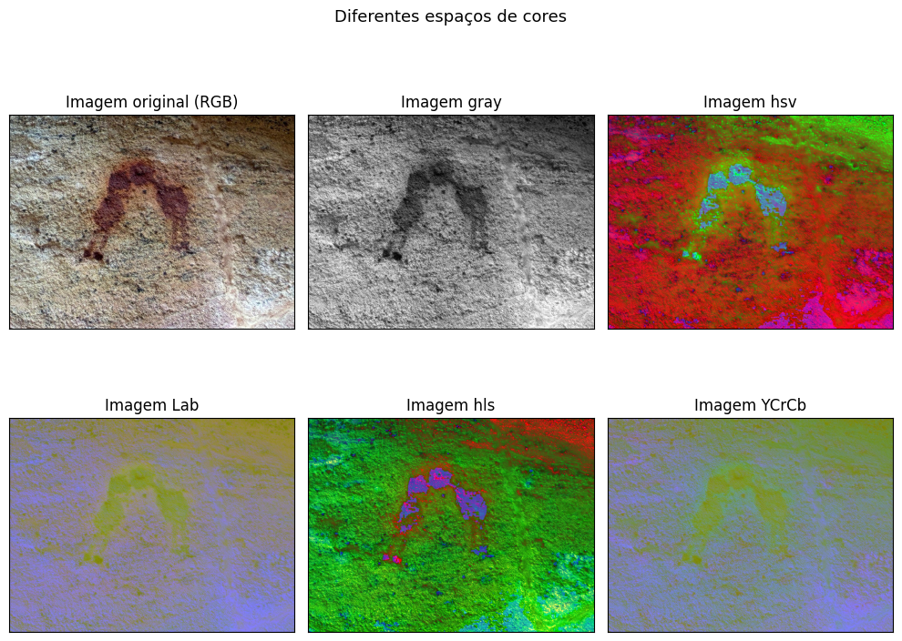
    


### Exibimos cada canal separadamente


```python
# Conversões para cada espaço de cor
rgb   = cv2.cvtColor(img, cv2.COLOR_BGR2RGB)
gray  = cv2.cvtColor(img, cv2.COLOR_BGR2GRAY)
hsv   = cv2.cvtColor(img, cv2.COLOR_BGR2HSV)
lab   = cv2.cvtColor(img, cv2.COLOR_BGR2LAB)
hls   = cv2.cvtColor(img, cv2.COLOR_BGR2HLS)
ycrcb = cv2.cvtColor(img, cv2.COLOR_BGR2YCrCb)

# Função auxiliar para plotar os canais de um espaço de cor
def plot_canais(imagem, nomes_canais, titulo):
    n = len(nomes_canais)
    plt.figure(figsize=(4 * n, 4))
    for i in range(n):
        plt.subplot(1, n, i + 1)
        plt.imshow(imagem[:, :, i])
        plt.title(nomes_canais[i])
        plt.xticks([]); plt.yticks([])
    plt.suptitle(titulo, fontsize=13)
    plt.tight_layout()
    plt.show()

# Visualização dos canais individuais de cada espaço
plot_canais(hsv,   ['H (matiz)', 'S (saturação)', 'V (valor)'],      'Canais do espaço HSV')
plot_canais(lab,   ['L* (luminosidade)', 'a* (verde↔vermelho)', 'b* (azul↔amarelo)'], 'Canais do espaço Lab')
plot_canais(hls,   ['H (matiz)', 'L (luminosidade)', 'S (saturação)'], 'Canais do espaço HLS')
plot_canais(ycrcb, ['Y (luminância)', 'Cr (crominância vermelha)', 'Cb (crominância azul)'], 'Canais do espaço YCrCb')

# Para RGB, plotamos os três canais também
plot_canais(rgb,   ['R (vermelho)', 'G (verde)', 'B (azul)'], 'Canais do espaço RGB')
```


    
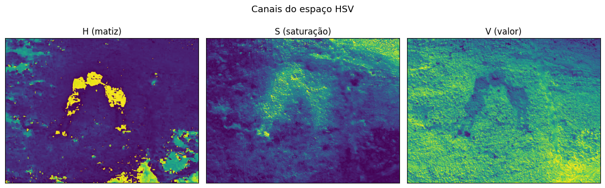
    


    
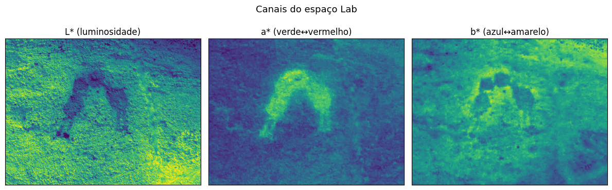
    


    
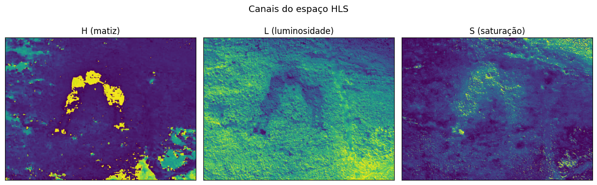
    


    
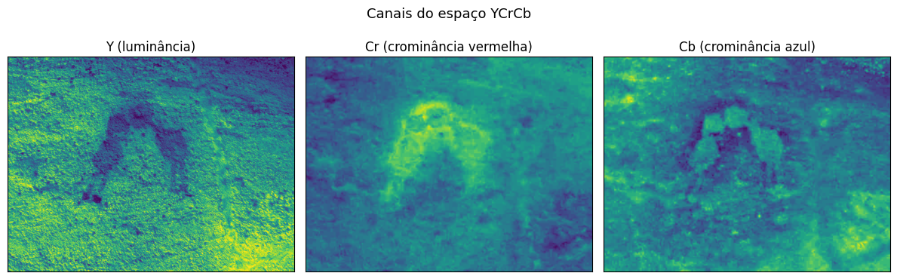
    


    
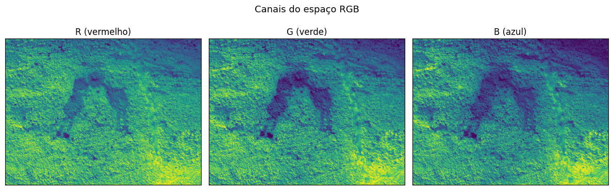
    


### Exibir os canais separadamente como imagens em tons de cinza


```python
# Conversões para cada espaço de cor
rgb   = cv2.cvtColor(img, cv2.COLOR_BGR2RGB)
gray  = cv2.cvtColor(img, cv2.COLOR_BGR2GRAY)
hsv   = cv2.cvtColor(img, cv2.COLOR_BGR2HSV)
lab   = cv2.cvtColor(img, cv2.COLOR_BGR2LAB)
hls   = cv2.cvtColor(img, cv2.COLOR_BGR2HLS)
ycrcb = cv2.cvtColor(img, cv2.COLOR_BGR2YCrCb)

# Função auxiliar para plotar os canais de um espaço de cor
def plot_canais(imagem, nomes_canais, titulo):
    n = len(nomes_canais)
    plt.figure(figsize=(4 * n, 4))
    for i in range(n):
        plt.subplot(1, n, i + 1)
        plt.imshow(imagem[:, :, i], cmap='gray')
        plt.title(nomes_canais[i])
        plt.xticks([]); plt.yticks([])
    plt.suptitle(titulo, fontsize=13)
    plt.tight_layout()
    plt.show()

# Visualização dos canais individuais de cada espaço
plot_canais(hsv,   ['H (matiz)', 'S (saturação)', 'V (valor)'],      'Canais do espaço HSV')
plot_canais(lab,   ['L* (luminosidade)', 'a* (verde↔vermelho)', 'b* (azul↔amarelo)'], 'Canais do espaço Lab')
plot_canais(hls,   ['H (matiz)', 'L (luminosidade)', 'S (saturação)'], 'Canais do espaço HLS')
plot_canais(ycrcb, ['Y (luminância)', 'Cr (crominância vermelha)', 'Cb (crominância azul)'], 'Canais do espaço YCrCb')

# Para RGB, plotamos os três canais também
plot_canais(rgb,   ['R (vermelho)', 'G (verde)', 'B (azul)'], 'Canais do espaço RGB')
```


    
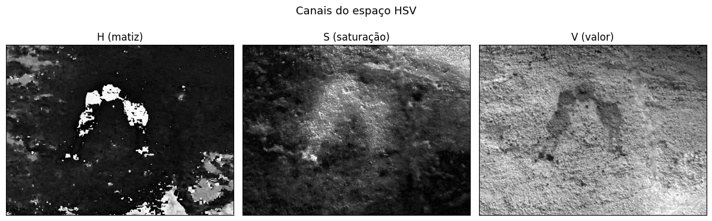
    


    
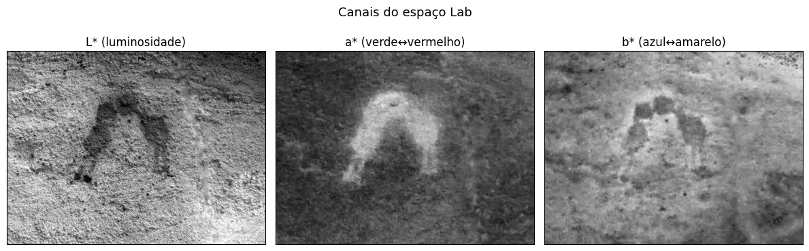
    


    
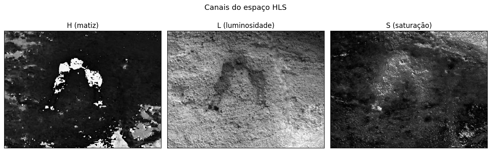
    


    
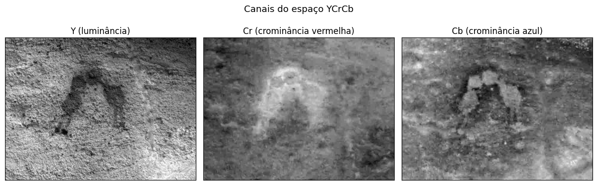
    


    
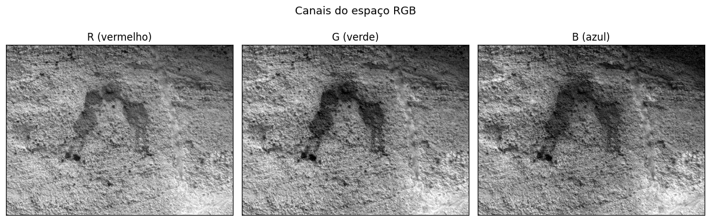
    

